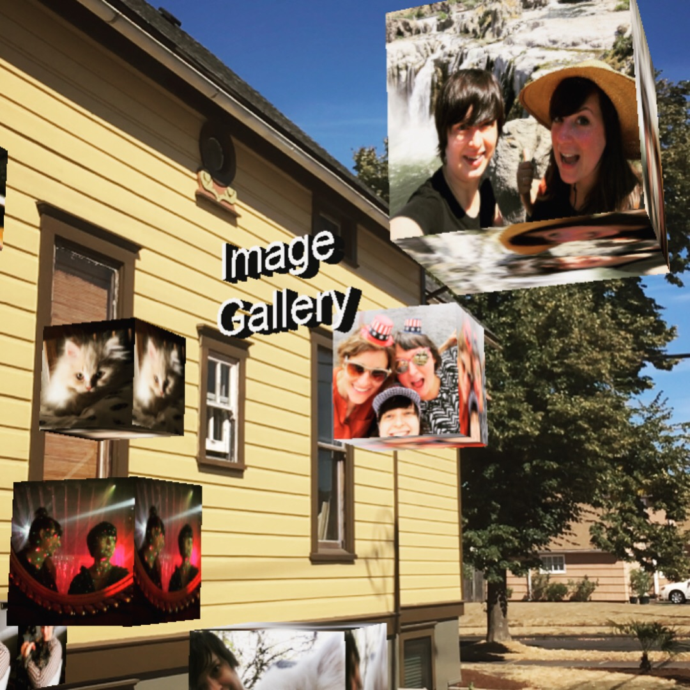

## AR Viro Test Augmented Reality App

### Description:
Playing around with having my hardcoded square images render as an AR gallery of spinning 3D cubes when viewed on mobile Viro app testbed. I hope to make images and positioning dynamic, and add a component to upload images from a phone gallery.

### Created with React-Native and ViroReact.
by Sarah Rehmer https://github.com/Rehmsy

### To use:
1. Clone repository. 
2. CD into directory then run npm i.
3. Open project in editor. 
4. Run npm start.
5. Create account with Viro Media and request API key: https://viromedia.com/viroreact/
6. Enter the API key in App.js
    var sharedProps = {
    apiKey:'ENTER API KEY HERE',
    }
7. Open Viro Media mobile app. 
  * Log in.
  * Click menu bars on top left.
  * Click 'Enter Testbed.'
  * Enter your local IP address or the NGrok Packager Server endpoint   address that displays in you terminal and hit GO.
      (You should see text and bundles with green bars in computer terminal). You made need to reload the app on your mobile device before successfully connecting. 

  Main file: HelloWorldSceneAR.js

